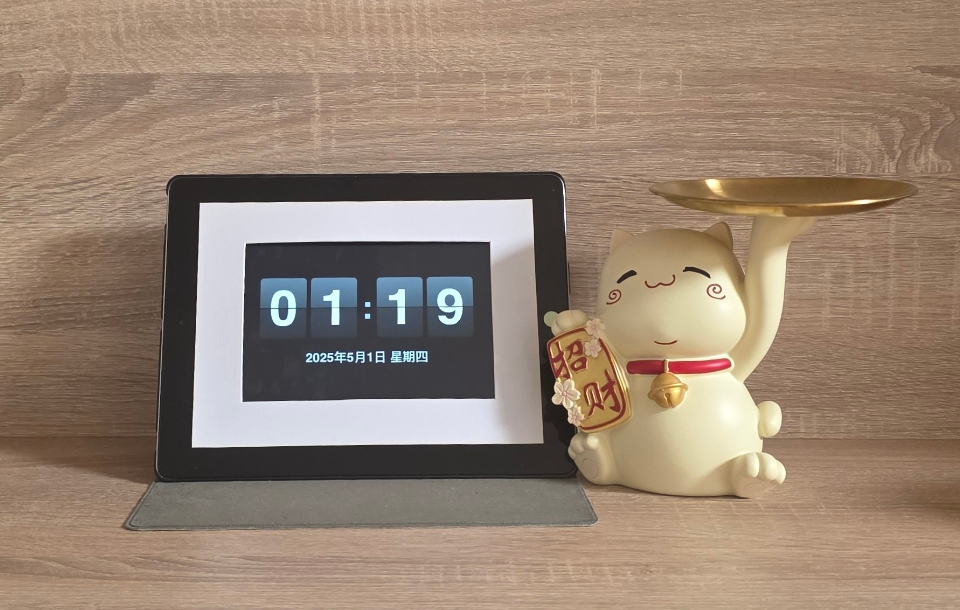

# 老旧设备兼容的在线翻页时钟
[DEMO](https://gptzm.github.io/online-clock/)
这是一个专为老旧设备打造的在线翻页时钟应用，实测可兼容iPad2等旧设备。通过纯前端技术实现了美观的翻页动画效果，并提供丰富的实用功能。

如果你也有平板或者手机等旧设备已经安装不了高版本的软件了，那可以设置长亮看时间。网上找到的在线时钟展示效果和兼容性不尽如人意，所以我用AI写了这个项目。

下图是我实拍的iPad2效果图，因为老设备不支持隐藏顶栏，故另外贴了一圈白边遮挡，在支持全屏的设备上则可以一键全屏。

## 核心特点

- **高兼容性设计**：针对老旧设备优化，确保在iPad2等设备上流畅运行
- **整点报时**：支持自定义报时时段，智能调节音量，夜间自动降低音量
- **自由布局**：可拖动调整位置和大小，双击快速恢复默认设置
- **设置保存**：自动记住用户的所有个性化设置，下次访问时自动恢复

## 使用指南

- **基本操作**：
  - 点击"整点报时"开启/关闭整点报时功能
  - 点击"隐藏秒"/"显示秒"切换秒数显示
  - 点击"+"或"-"调整整体大小
  - 点击🌓按钮切换深色/浅色主题
  - 点击全屏按钮进入/退出全屏模式

- **高级操作**：
  - 上下拖动：按住时钟区域上下拖动可调整时钟在屏幕中的位置
  - 调整日期大小：左右拖动日期区域右侧的调整把手可改变日期文字大小
  - 双击重置：双击时钟区域可重置所有自定义设置（位置、大小等）
  - 整点报时设置：点击"整点报时"按钮可进入报时设置，选择需要报时的小时和报时方式

- **全屏模式注意事项**：
  - 全屏模式下禁用所有交互功能，专注于时间显示
  - 点击右上角退出按钮或按ESC键可退出全屏模式

## 技术实现

- 纯原生JavaScript实现，不依赖任何第三方库或框架
- 针对旧版浏览器提供CSS前缀和兼容性处理
- 优化的资源占用，确保在低配置设备上运行流畅
- 针对触摸设备优化的交互体验
- 兼容各类浏览器（包括Safari、Edge等）的交互实现

## 适用场景

- 老旧平板作为桌面时钟使用
- 教室、办公室的时间显示
- 会议室时间提示和管理
- 需要整点提醒的场景
